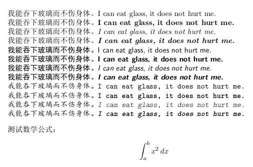

# Introduction

zhfonts is a module for Chinese typesetting in [ConTeXt](https://wiki.contextgarden.net/Installation)(MkIV or LMTX). It can define the typefaces for Chinese fonts and support the tuning of punctuations. The latter is mainly implemented by using two callback which is offered by ConTeXt MkIV or LMTX:

```lua
tasks.appendaction("processors","after", ...)
tasks.appendaction("finalizers", "after", ...)
```

Therefore I could not guarantee this module works always unless that callback is alive.

# Installition

Put the module (the directory named zhfonts) into your ConTeXt directory, for example mine is "/home/garfileo/opt/context" in a Linux system (For windows, it can be "c:\context"). I put the module into the directory

```plain
/home/garfileo/opt/context/tex/texmf-local/tex/context/third
```

Then excute the following command to enable the context program to find the module files.

```console
$ context --generate
```

You can test whether the context program find the module files, for example t-zhfonts.lua by the command:

```console
$ mtxrun --script base --search t-zhfonts.lua
```

I get the result in my computer:

```
/home/garfileo/opt/context-lmtx/tex/texmf-local/tex/context/third/zhfonts/t-zhfonts.lua
```

In addition, zhfonts module needs three Chinese fonts, simsun.ttc, simhei.ttf and simkai.ttf, which can be obtained from your or your friends' MS Windows system (C:\Windows\Fonts). These fonts can be put into the directory `"YOUR ConTeXt diretory"/tex/texmf-local/fonts/truetype/msfonts` then excute

```console
$ context --generate
$ mtxrun --script fonts --reload --force
```

The following command can be used to check whether the font exists.

```console
$ mtxrun --script fonts --list --all --pattern=sim*
identifier       familyname   fontname   filename     subfont

nsimsun          nsimsun      nsimsun    simsun.ttc   2
nsimsunnormal    nsimsun      nsimsun    simsun.ttc   2
nsimsunregular   nsimsun      nsimsun    simsun.ttc   2
simhei           simhei       simhei     simhei.ttf
simheinormal     simhei       simhei     simhei.ttf
simheiregular    simhei       simhei     simhei.ttf
simsun           simsun       simsun     simsun.ttc   1
simsunnormal     simsun       simsun     simsun.ttc   1
simsunregular    simsun       simsun     simsun.ttc   1
```

# Basic usage

If the work above done, you can try the following example to test the module and the Chinese fonts works normally.

```TeX
\usemodule[zhfonts]

\starttext
\startbuffer[foo]
\tf 我能吞下玻璃而不伤身体。I can eat glass, it does not hurt me.\par
\bf 我能吞下玻璃而不伤身体。I can eat glass, it does not hurt me.\par
\it 我能吞下玻璃而不伤身体。I can eat glass, it does not hurt me.\par
\bi 我能吞下玻璃而不伤身体。I can eat glass, it does not hurt me.\par
\stopbuffer

{\rm\getbuffer[foo]}
{\ss\getbuffer[foo]}
{\tt\getbuffer[foo]}
\blank

测试数学公式：

\startformula
\int_{a}^{b} x^2 \,dx
\stopformula
\stoptext
```

If you can get the result which looks like the following figure, all is well.




# To be continued.
