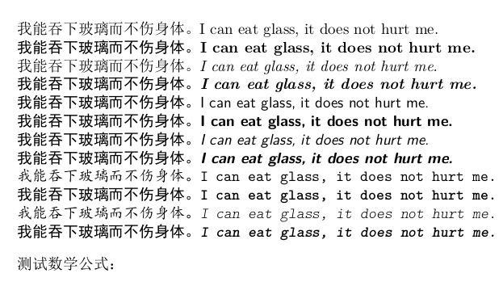
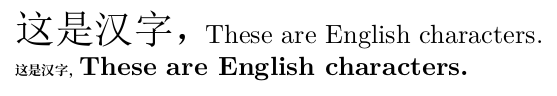

# Introduction

zhfonts is a module for Chinese typesetting in [ConTeXt](https://wiki.contextgarden.net/Installation) (MkIV or LMTX). It can be used to define the typefaces for Chinese fonts and to support the tuning of punctuations. The latter is mainly based on two callbacks offered by ConTeXt MkIV or LMTX:

```lua
tasks.appendaction("processors","after", ...)
tasks.appendaction("finalizers", "after", ...)
```

Therefore I could not guarantee this module works always unless that callback is alive.

# Installation

Put the module (the directory named zhfonts) into your `$TEXROOT/texmf-local/tex/context/third` directory, for example my TEXROOT is "$HOME/opt/context/tex" in a Linux system (For windows, it can be "c:\context\tex"). I put the module into the directory

```plain
$HOME/opt/context/tex/texmf-local/tex/context/third
```

Then excute the following command to enable the context program to find the module files,

```console
$ context --generate
```

You can test whether the context program find the module files for example "t-zhfonts.lua" by the command:

```console
$ mtxrun --script base --search t-zhfonts.lua
```

In my computer, the result is

```
/home/garfileo/opt/context/tex/texmf-local/tex/context/third/zhfonts/t-zhfonts.lua
```

In addition, zhfonts module needs three Chinese fonts, **simsun.ttc**, **simhei.ttf** and **simkai.ttf**, which can be obtained from your or your friends' MS Windows system (C:\Windows\Fonts). These fonts can be put into the directory `"YOUR ConTeXt diretory"/tex/texmf-local/fonts/truetype/msfonts` then excute

```console
$ context --generate
$ mtxrun --script fonts --reload --force
```

This command can be used to check whether the fonts exist:

```console
$ mtxrun --script fonts --list --all --pattern="sim*"
```

The result should be

```plain
identifier       familyname   fontname   filename     subfont   instances

nsimsun          nsimsun      nsimsun    simsun.ttc   2
nsimsunnormal    nsimsun      nsimsun    simsun.ttc   2
nsimsunregular   nsimsun      nsimsun    simsun.ttc   2
simhei           simhei       simhei     simhei.ttf
simheinormal     simhei       simhei     simhei.ttf
simheiregular    simhei       simhei     simhei.ttf
simsun           simsun       simsun     simsun.ttc   1
simsunnormal     simsun       simsun     simsun.ttc   1
simsunregular    simsun       simsun     simsun.ttc   1
```

zhfonts module uses the information of the column "fontname" to specify one font.

# Basic usage

Try the following example to test whether the module and the Chinese fonts works normally.

```TeX
\usemodule[zhfonts]

\starttext
\startbuffer[foo]
\tf 我能吞下玻璃而不伤身体。I can eat glass, it does not hurt me.\par
\bf 我能吞下玻璃而不伤身体。I can eat glass, it does not hurt me.\par
\it 我能吞下玻璃而不伤身体。I can eat glass, it does not hurt me.\par
\bi 我能吞下玻璃而不伤身体。I can eat glass, it does not hurt me.\par
\stopbuffer

{\rm\getbuffer[foo]}
{\ss\getbuffer[foo]}
{\tt\getbuffer[foo]}
\blank
测试数学公式：

\startformula
\int_{a}^{b} x^2 \,dx
\stopformula
\stoptext
```

If the result looks like the following figure, all is well.



# \setupzhfonts

The command `\setupzhfonts` which can be used to set up the bodyfonts (text fonts) and to change default fonts in the module.

For example, set up sans font specified size as the text bodyfont:

```TeX
\usemodule[zhfonts][family=ss,size=14pt]
\starttext
我能吞下玻璃而不伤身体。I can eat glass, it does not hurt me.
\stoptext
```


The following example shows the default serif bold font (\rm\bf) and serif bold italic font (\rm\it) are sbustituded by the [NotoSerifCJK-Bold.ttc](https://github.com/notofonts/noto-cjk/tree/main/Serif/OTC) (It need be installed by yourself refering to the above installation for simsun.ttc, simhei.ttf, etc.).

```TeX
\usemodule[zhfonts]
\setupzhfonts
  [serif]
  [bold=notoserifcjkscbold,
   bolditalic=notoserifcjkscbold]
\starttext
\bf 我能吞下玻璃而不伤身体。I can eat glass, it does not hurt me.\par
\bi 我能吞下玻璃而不伤身体。I can eat glass, it does not hurt me.
\stoptext
```


The following example shows how to change the serif fonts totally,

```TeX
\usemodule[zhfonts]
\setupzhfonts
  [serif]
  [regular=notoserifcjkscregular,
   bold=notoserifcjkscbold,
   italic=notoserifcjkscregular,
   bolditalic=notoserifcjkscbold]
\starttext
我能吞下玻璃而不伤身体。I can eat glass, it does not hurt me.\par
\bf 我能吞下玻璃而不伤身体。I can eat glass, it does not hurt me.\par
\it 我能吞下玻璃而不伤身体。I can eat glass, it does not hurt me.\par
\bi 我能吞下玻璃而不伤身体。I can eat glass, it does not hurt me.
\stoptext
```


Analogously, "\setupzhfonts" can be used to change the sans (\ss) fonts and the mono (\tt) fonts. For changing Latin fonts, "\setupzhfonts" command format is

```TeX
\setupzhfonts
  [latin,serif|sans|mono]
  [regular=...,
   bold=...,
   italic=...,
   bolditalic=...]
```

For math fonts, zhfonts module use the "modern" typescript defined by ConTeXt team. If you want to use other math fonts, please refer to https://wiki.contextgarden.net/Math_fonts and use some typescript name as the argument of "\setupzhfonts". For example to use the "antykwa" typescript, you can do

```TeX
\usemodule[zhfonts]
\setupzhfonts[math][antykwa]
\starttext
数学公式 $\sum_{i=1}^n α_i x^i$
\stoptext
```


To add some feature for fonts, particularly Latin fonts, just need

```TeX
\setupzhfonts[latin,features][The features you want]
```

For example to add the features "onum", 

```TeX
\usemodule[zhfonts]
\setupzhfonts[latin,features][onum=yes]

\starttext
\inframed{\switchtobodyfont[16pt]字体特性：It's 2023!}
% lmroman10regular has been loaded in zhfonts module.
\showotfcomposition{lmroman10regular*latin at 16pt}{}{It's 2023!}
\stoptext
```


# rscale parameter

Although Latin characters are included in a Chinese font, they are ugly in general so that zhfonts module always uses a Chinese font as the fallback font for a Latin font. However the design sizes two different kind of fonts are often different. We can adjust the scale of Chinese font to solve it in condition of the scale of Latin fonts fixed. For example,

```TeX
\usemodule[zhfonts][size=16pt]
\setupzhfonts
  [serif]
  [regular=@1.5, % adjust the scale of default font.
   bold=notoserifcjkscbold@0.5]

\starttext
这是汉字，These are English characters.\par
\bf 这是汉字，These are English characters.
\stoptext
```



# Only using the features of Chinese punctuation: protrusion and space-compressing

If you want to use `\definefallbackfamily` and `\definefontfamily` to define the font familys which mixed Chinese fonts and Latin fonts, you can do this like

```TeX
\definefallbackfamily
  [myfont]
  [rm]
  [simsun] % font family name
  [bf={name:simhei}, % font name
    it={name:kaiti},
    bi={name:simhei},
    preset=range:chinese]
\definefontfamily[myfont][rm][latinmodernroman]
```

You can forbid zhfonts to generate the typescript providing the equivalent definition like above and only use the features of Chinese punctuation which are not provided in your ConTeXt. For example,

```TeX
% forbid zhfonts to generate typescript
% and use the feature "zhspuncs" provided by zhfonts module.
\usemodule[zhfonts][family=none]
\definefontfeature[hanzi][default][protrusion=zhspuncs]
\definefontfeature[latin][default][onum=yes,pnum=yes]
\definefallbackfamily
  [myfonts][serif][nsimsun]
  [features=hanzi,force=yes,preset=range:chinese]
\definefontfamily[myfonts][serif][texgyrepagella][features=latin]
\setupbodyfont[myfonts,rm]

\starttext
测试结果 1：「T\smallcaps{est}」\\
测试结果 2：「0123456789 特效」
\stoptext
```


# \showzhfonts

For debugging, criticizing or improvement this module, You can get the content of the typescript by "\showzhfonts", which is generated by the script "t-zhfonts.lua". For example,

```TeX
\usemodule[zhfonts]
\starttext
\showzhfonts
\stoptext
```

See the result in [Test result 9](test/test-9.pdf)
